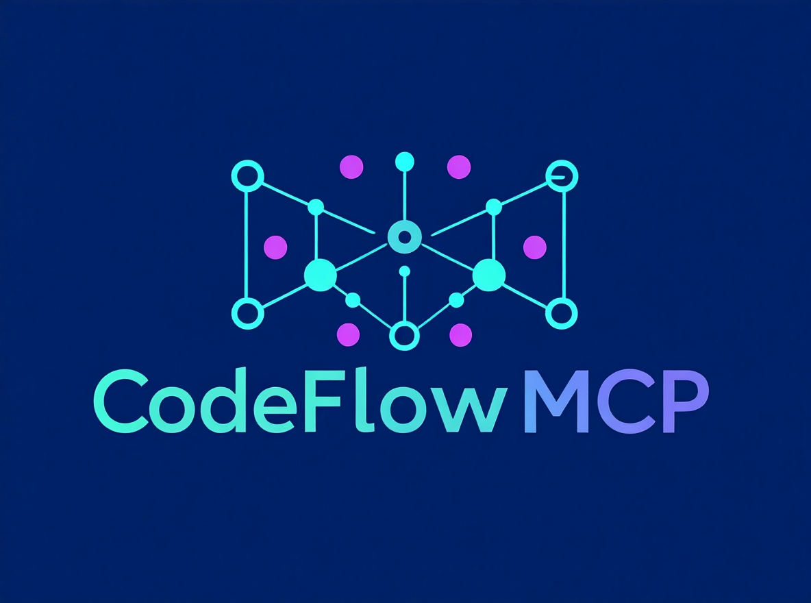

# CodeFlow: Cognitive Load Optimized Code Analysis Tool



## Overview

CodeFlow is a powerful code analysis tool designed to help developers and autonomous agents understand complex codebases with minimal cognitive overhead. It generates detailed call graphs, identifies critical code elements, and provides semantic search capabilities, all while adhering to principles that prioritize human comprehension.

By extracting rich metadata from Tree-sitter ASTs and leveraging a persistent vector store (ChromaDB), CodeFlow enables efficient querying and visualization of code structure and behavior across Python, TypeScript/TSX, and Rust codebases.

The tool provides three main interfaces:
- **CLI Tool**: A command-line interface for direct analysis and querying of codebases.
- **MCP Server**: A Model Context Protocol server that integrates with AI assistants and IDEs for real-time code analysis.
- **Unified API**: A single programmatic interface that automatically detects and analyzes both Python and TypeScript codebases.

## Features

### Core Analysis Capabilities
- **Deep AST Metadata Extraction (Python, TypeScript/TSX, Rust via Tree-sitter):** Gathers comprehensive details about functions and classes including:
  - Parameters, return types, docstrings
  - Cyclomatic complexity and Non-Comment Lines of Code (NLOC)
  - Applied decorators (e.g., `@app.route`, `@transactional`)
  - Explicitly caught exceptions
  - Locally declared variables
  - Inferred external library/module dependencies
  - Source body hash for efficient change detection
- **Structured Data Indexing (JSON/YAML):**
  - Parses and indexes configuration files (`.json`, `.yaml`, `.yml`).
  - Enables semantic search for configuration keys and values (e.g., "database port", "api url").
  - Flattens hierarchical data into semantic chunks for precise retrieval.
- **Unified Interface:** Single API that automatically detects and analyzes Python, TypeScript/TSX, and Rust codebases without manual language specification.
- **Intelligent Call Graph Generation:**
  - Builds a graph of function-to-function calls.
  - Employs multiple heuristics to identify potential entry points in the codebase.
- **Persistent Vector Store (ChromaDB):**
  - Stores all extracted code elements and call edges as semantic embeddings.
  - Enables rapid semantic search and filtered queries over the codebase's functions and their metadata.
  - Persists analysis results to disk, allowing instant querying of previously analyzed projects without re-parsing.
  - **Automatic Cleanup:** Background process removes stale references to deleted files, keeping the index accurate and efficient.

### Visualization and Output
- **Mermaid Diagram Visualization:**
  - Generates text-based Mermaid Flowchart syntax for call graphs.
  - Highlights functions relevant to a semantic query.
  - Includes an **LLM-optimized mode** for concise, token-efficient graph representations suitable for Large Language Model ingestion, providing clear aliases and FQN mappings.

### MCP Server Features
- **Real-time Analysis:** File watching with incremental updates for dynamic codebases.
- **Background Maintenance:** Automatic cleanup of stale file references in the vector store to maintain index accuracy.
- **Tool-based API:** Exposes analysis capabilities through MCP tools for AI assistants.
- **Session Context:** Maintains per-session state for complex analysis workflows.
- **Comprehensive Tools:** Semantic search, call graph generation, function metadata retrieval, entry point identification, and Mermaid graph generation.

### CLI Tool Features
- **Batch Analysis:** Complete codebase analysis with report generation.
- **Interactive Querying:** Semantic search against analyzed codebases.
- **Flexible Output:** JSON reports, Mermaid diagrams, and console output.
- **Incremental Updates:** Query existing analyses without full re-processing.
- **Call Graph Metrics:** Writes `.codeflow/reports/call_graph_metrics.json` and `.codeflow/reports/call_graph_metrics.md` for baseline comparisons.

### Cognitive Load Optimization
- Designed with principles to make the tool's output and its own codebase easy to understand and use.
- **Mental Model Simplicity:** Clear, predictable patterns in code and output.
- **Explicit Behavior:** Favor clarity over brevity, making implicit actions visible (e.g., decorators).
- **Information Hiding & Locality:** Well-defined modules, keeping related code together.
- **Minimal Background Knowledge:** Self-describing data, common patterns, reduced need for memorization.
- **Strategic Abstraction:** Layers introduced only when they genuinely reduce overall complexity.
- **Linear Understanding:** Code and output structured for easy top-to-bottom reading.

## Comparison

| System  | Project Size | Indexing Time |
|---------|--------------|---------------|
| RooCode | 40k LOC      | 2.2 min       |
| CodeFlow| 40k LOC      | 8.6s          |


## Requirements

Before running CodeFlow, ensure you have Python 3.8+ and the following dependencies installed:

```txt
chromadb
sentence-transformers
hdbscan
scikit-learn
mcp[cli]
pyyaml
watchdog>=2.0
pytest
pytest-asyncio
pydantic
tree-sitter
tree-sitter-python
tree-sitter-typescript
tree-sitter-rust
```

## Installation

### Install with uv (recommended)

Install the CLI and MCP server as user-level tools:

```bash
uv tool install code-flow
```

Expose uv's tool bin directory on your PATH:

```bash
export PATH="$(uv tool dir --bin):$PATH"
```

Add the export to your shell profile (e.g., `~/.zshrc`) to persist it.

One-off execution without installation:

```bash
uvx --from code-flow code_flow --help
```

### From Source
Clone the repository and install dependencies:

```bash
git clone https://github.com/yourusername/codeflow.git
cd codeflow
pip install -e .
```

This will install the package in editable mode and make both the CLI tool and MCP server available.

### CLI Tool
The CLI tool is available as a module:

```bash
code_flow --help
```

### MCP Server
The MCP server is available as a script:

```bash
code_flow_mcp_server --help
```

## Usage

### CLI Tool

The `code_flow.cli.code_flow` module is the main entry point for command-line analysis. All commands start with a subcommand:

`code_flow analyze -- [YOUR_CODE_DIRECTORY]`

Replace `[YOUR_CODE_DIRECTORY]` with the path to your project. If omitted, the current directory (`.`) will be used.

#### 1. Analyze a Codebase and Generate a Report

This command will parse your codebase, build the call graph, populate the ChromaDB vector store (persisted in `<project_root>/.codeflow/chroma/`), and generate a JSON report. Language detection is automatic.

```bash
code_flow analyze -- [YOUR_CODE_DIRECTORY] --output my_analysis_report.json
```

#### 2. Querying the Codebase (Analysis + Query)

Run a full analysis and then immediately perform a semantic search. This will update the vector store if code has changed.

```bash
code_flow query -- [YOUR_CODE_DIRECTORY] --query "functions that handle user authentication"
```

#### 3. Querying an Existing Analysis (Query Only)

Once a codebase has been analyzed (i.e., the `.codeflow/chroma/` directory exists under `project_root`), you can query it much faster without re-running the full analysis:

```bash
code_flow query -- [YOUR_CODE_DIRECTORY] --no-analyze --query "functions related to data serialization"
```

#### 4. Generating Mermaid Call Graphs

You can generate Mermaid diagrams of the call graph for functions relevant to your query.

**Standard Mermaid (for visual rendering):**
```bash
code_flow query -- [YOUR_CODE_DIRECTORY] --query "database connection pooling" --mermaid
```
The output is Mermaid syntax, which can be copied into a Mermaid viewer (e.g., VS Code extension, Mermaid.live) for visualization.

**LLM-Optimized Mermaid (for AI agents):**
```bash
code_flow query -- [YOUR_CODE_DIRECTORY] --query "main entry point setup" --llm-optimized
```
This output is stripped of visual styling and uses short aliases for node IDs, with explicit `%% Alias: ShortID = Fully.Qualified.Name` comments. This minimizes token count for LLMs while providing all necessary structural information.

#### Command Line Arguments

Common arguments (available on subcommands):

- `<directory>`: (Positional, optional) Path to the codebase directory. If provided, overrides `watch_directories` in config. If not provided, uses `watch_directories` from config or defaults to current directory.
- `--config`: Path to configuration YAML file (default: `codeflow.config.yaml`).
- `--embedding-model`: Embedding model to use. Shortcuts: `fast` (384-dim), `medium` (384-dim), or `accurate` (768-dim). Default: `fast`. See [Embedding Model Configuration](#embedding-model-configuration) for details.
- `--max-tokens`: Maximum tokens per chunk for embedding model. Default: `256`. Increase for larger context windows (must match model max sequence length).
- `--language`: Force language selection (`python`, `typescript`, `rust`). Defaults to auto-detection.

Subcommand-specific arguments:

- `analyze`: `--output`, `--summaries`, `--drift`.
- `query`: `--query`, `--no-analyze`, `--mermaid`, `--llm-optimized`, `--limit`.
- `graphs`: `--format`, `--fqns`, `--output`, `--llm-optimized`.
- `drift`: `--output`.
- `memory`: `add|query|list|reinforce|forget`.


#### Example Report Output

The `code_analysis_report.json` provides a comprehensive JSON structure including a summary, identified entry points, class summaries, and a detailed call graph (functions with all metadata, and edges).

### MCP Server

The MCP server provides programmatic access to CodeFlow's analysis capabilities through the Model Context Protocol. It can be integrated with AI assistants, IDEs, and other MCP-compatible tools.

#### Starting the Server

Start the MCP server with default configuration:

```bash
code_flow_mcp_server
```

Or with a custom configuration file:

```bash
code_flow_mcp_server --config path/to/config.yaml
```

**Note**: The server looks for `codeflow.config.yaml` in the current directory by default.

**Background Analysis**: The server starts immediately and accepts connections while analyzing the codebase in the background. During the initial analysis, tools may return empty or partial results as the codebase is being indexed. This is normal behavior for first-time scans. Use the `ping` tool to check analysis progress.

#### Available Tools

The server exposes the following tools through the MCP protocol:

- **`ping`**: Test server connectivity and check analysis status. Returns current analysis state (`not_started`, `in_progress`, `completed`, `failed`) and count of indexed functions.
- **`semantic_search`**: Search functions semantically using natural language queries. Includes analysis status in response.
- **`get_call_graph`**: Retrieve call graph in JSON or Mermaid format. Includes analysis status in response.
- **`get_function_metadata`**: Get detailed metadata for a specific function. Includes analysis status in response.
- **`query_entry_points`**: Get all identified entry points in the codebase. Includes analysis status in response.
- **`generate_mermaid_graph`**: Generate Mermaid diagram for call graph visualization. Includes analysis status in response.
- **`cleanup_stale_references`**: Manually trigger cleanup of stale file references in the vector store
- **`update_context`**: Update session context with key-value pairs
- **`get_context`**: Retrieve current session context
- **`reinforce_memory`**: Create or reinforce a Cortex memory entry (TRIBAL/EPISODIC/FACT).
- **`query_memory`**: Search Cortex memory with decay-aware ranking.
- **`list_memory`**: List Cortex memory entries with filters/pagination.
- **`forget_memory`**: Delete a Cortex memory entry by id.
- **Resources**: `memory://top` and `memory://<knowledge_id>` expose top Cortex memories as MCP resources.

**Note**: All analysis-dependent tools include an `analysis_status` field in their responses to inform clients about the current state of code analysis.

#### Testing with Client

Use the included client to test server functionality:

```bash
python client.py
```

This performs a handshake and tests basic tool functionality.

## Configuration

### Configuration

Both the CLI tool and MCP server share a central configuration system. The default configuration file is `codeflow.config.yaml` in the current working directory.

```yaml
project_root: "/path/to/project"
watch_directories: ["."]  # Directories to analyze (default: current directory)
ignored_patterns: ["venv", "**/__pycache__", ".git", "node_modules"]  # Patterns to ignore
max_graph_depth: 3  # Maximum depth for graph traversal
embedding_model: "all-MiniLM-L6-v2"  # Embedding model to use
max_tokens: 256  # Maximum tokens per chunk
language: "python" # Default language ("python", "typescript", or "rust")
call_graph_confidence_threshold: 0.8
```

Customize these settings by creating your own config file and passing it with `--config`.

#### Cortex Memory Configuration

```yaml
memory_enabled: true
memory_collection_name: "cortex_memory_v1"
memory_similarity_weight: 0.7
memory_score_weight: 0.3
memory_min_score: 0.1
memory_cleanup_interval_seconds: 3600
memory_grace_seconds: 86400
memory_half_life_days:
  TRIBAL: 180.0
  EPISODIC: 7.0
  FACT: 30.0
memory_decay_floor:
  TRIBAL: 0.1
  EPISODIC: 0.01
  FACT: 0.05
```

#### Cortex Memory CLI

```bash
# Add tribal memory
code_flow memory add --type TRIBAL --content "Use snake_case for DB columns" --tags conventions

# Query memory
code_flow memory query --query "DB column naming" --type TRIBAL --limit 5

# List episodic memory
code_flow memory list --type EPISODIC --limit 10

# Reinforce and forget
code_flow memory reinforce --knowledge-id <uuid>
code_flow memory forget --knowledge-id <uuid>
```

### Embedding Model Configuration

CodeFlow uses [SentenceTransformers](https://www.sbert.net/) for semantic code search. You can choose between different embedding models to balance speed and accuracy:

#### Available Models

| Shorthand | Model Name | Dimensions | Speed | Use Case |
|-----------|------------|------------|-------|----------|
| `fast` | `all-MiniLM-L6-v2` | 384 | Fastest | Quick analysis, smaller codebases |
| `medium` | `all-MiniLM-L12-v2` | 384 | Balanced | Good balance of speed and quality |
| `accurate` | `all-mpnet-base-v2` | 768 | Slower | Detailed analysis, larger codebases |


#### CLI Configuration

Use the `--embedding-model` flag with either a shorthand or specific model name:

```bash
# Using shorthand (recommended)
code_flow analyze -- . --embedding-model fast
code_flow analyze -- . --embedding-model accurate

# Using specific model name
code_flow analyze -- . --embedding-model all-MiniLM-L6-v2
```

Adjust chunk size with `--max-tokens` (default: 256):

```bash
# Note: all models have max sequence length of 384 tokens
code_flow analyze -- . --embedding-model accurate --max-tokens 384
```

#### MCP Server Configuration

Configure in your YAML config file:

```yaml
# Fast configuration (default)
embedding_model: "all-MiniLM-L6-v2"
max_tokens: 256

# Accurate configuration (max sequence length is 384)
embedding_model: "all-mpnet-base-v2"
max_tokens: 384
```

#### Important Notes

- **Consistency**: Once a vector store is created with a specific embedding dimension (384 or 768), you must continue using models with the same dimension. CodeFlow will automatically detect and use the existing dimension.
- **Performance**: 384-dim models are ~2x faster than 768-dim models with minimal accuracy loss for code search.
- **Custom Models**: You can specify any SentenceTransformer model name. See the [full list](https://www.sbert.net/docs/pretrained_models.html).

### Meta-RAG: LLM-Driven Code Summaries (Optional)

CodeFlow supports optional LLM-driven semantic code summaries to enhance context retrieval for AI agents. This feature generates concise, natural-language summaries of functions and classes that are indexed alongside the code, enabling more efficient and accurate semantic search.

#### Configuration

Enable summary generation in your `codeflow.config.yaml`:

```yaml
# Summary Generation (Meta-RAG)
summary_generation_enabled: false  # Set to true to enable
llm_config:
  api_key_env_var: "OPENAI_API_KEY"
  base_url: "https://openrouter.ai/api/v1"  # Default: OpenRouter
  model: "x-ai/grok-4.1-fast"  # Default model
  max_tokens: 256  # Max tokens in LLM response per summary
  concurrency: 5  # Number of parallel summary generation workers
  
  # Smart filtering to reduce costs
  min_complexity: 3  # Only summarize functions with complexity >= 3
  min_nloc: 5  # Only summarize functions with >= 5 lines of code
  skip_private: true  # Skip functions starting with _ (private)
  skip_test: true  # Skip test functions (test_*, *_test)
  prioritize_entry_points: true  # Summarize entry points first
  
  # Depth control
  summary_depth: "standard"  # "minimal", "standard", "detailed"
  max_input_tokens: 2000  # Truncate function body if longer
```

**Smart Filtering Options:**

- **`min_complexity`**: Only summarize functions with cyclomatic complexity >= threshold (default: 0)
- **`min_nloc`**: Only summarize functions with >= N lines of code (default: 0)
- **`skip_private`**: Skip private functions - supports both Python (`_prefix`) and TypeScript (`private`/`protected` modifiers) (default: false)
- **`skip_test`**: Skip test functions (names containing "test") (default: false)
- **`prioritize_entry_points`**: Process entry points first (default: false)

**Depth Control:**

- **`minimal`**: Just name, signature, and code (lowest cost)
- **`standard`**: Adds docstring (balanced)
- **`detailed`**: Includes complexity, NLOC, decorators (highest quality)

**Token Limits:**

- **`max_tokens`**: Maximum tokens in LLM response (controls summary length)
- **`max_input_tokens`**: Truncate function body if longer (controls input cost)

#### Environment Variables

You can override configuration via environment variables:

- `OPENAI_API_KEY`: Your LLM API key (required when summary generation is enabled)
- `OPENAI_BASE_URL`: Override the base URL (default: `https://openrouter.ai/api/v1`)
- `OPENAI_SUMMARY_MODEL`: Override the model (default: `x-ai/grok-4.1-fast`)

#### How It Works

1. **Background Processing**: Summaries are generated asynchronously in the background after code analysis completes
2. **Resumable**: On restart, CodeFlow automatically identifies and generates summaries for any functions missing them
3. **Parallel Generation**: Multiple LLM requests run concurrently (configurable via `concurrency`)
4. **Retrieval**: Summaries are returned via the `get_function_metadata` tool and included in semantic search results

#### Example Usage

```bash
# Enable in config, then start MCP server
export OPENAI_API_KEY="your-api-key"
code_flow_mcp_server

# Summaries will be generated in the background
# Check progress with the ping tool
```

#### Cost Considerations

- Summary generation incurs LLM API costs (typically $0.001-0.01 per function depending on model)
- The feature is **disabled by default** to avoid unexpected costs
- Use faster, cheaper models like `grok-4.1-fast` for cost-effective summarization
- Summaries are cached in ChromaDB and only regenerated when code changes


## TypeScript Support

CodeFlow provides comprehensive TypeScript analysis capabilities with feature parity to Python support. It can analyze TypeScript applications, extract detailed metadata, and build call graphs for various TypeScript frameworks.

### Requirements

TypeScript analysis is performed using Tree-sitter parsing with the bundled language grammars.

### Usage Examples

#### Basic TypeScript Analysis
```bash
# Analyze a TypeScript project (language detection is automatic)
code_flow analyze -- /path/to/typescript/project --output analysis.json

# Query TypeScript codebase
code_flow query -- /path/to/typescript/project --query "user authentication functions"
```

#### Framework-Specific Examples

**Angular Application Analysis:**
```bash
# Analyze Angular project (language detection automatic)
code_flow query -- /path/to/angular-app --query "component lifecycle methods"

# Find Angular services
code_flow query -- /path/to/angular-app --query "injectable services"
```

**NestJS Application Analysis:**
```bash
# Analyze NestJS backend (language detection automatic)
code_flow query -- /path/to/nestjs-app --query "controller endpoints"

# Find service dependencies
code_flow query -- /path/to/nestjs-app --query "database service dependencies"
```

**React TypeScript Analysis:**
```bash
# Analyze React TypeScript components (language detection automatic)
code_flow query -- /path/to/react-ts-app --query "custom hooks"

# Find component prop types
code_flow query -- /path/to/react-ts-app --query "component interfaces"
```

#### TypeScript-Specific Features

**Type System Analysis:**
- **Interface Detection**: Identifies and extracts TypeScript interfaces and their implementations
- **Type Annotations**: Analyzes function parameters and return types
- **Generic Types**: Handles generic type definitions and constraints
- **Union/Intersection Types**: Processes complex type definitions
- **Decorator Analysis**: Detects Angular, NestJS, and custom decorators

**Framework Pattern Recognition:**
- **Angular**: Component, Service, Module, Directive decorators
- **NestJS**: Controller, Injectable, Module decorators
- **Express**: Route handlers and middleware detection
- **React**: Component classes and hooks detection

### TypeScript Configuration

The tool automatically detects and parses `tsconfig.json` for project structure information:

```json
{
  "compilerOptions": {
    "target": "ES2020",
    "module": "commonjs",
    "strict": true,
    "esModuleInterop": true,
    "skipLibCheck": true,
    "forceConsistentCasingInFileNames": true
  },
  "include": ["src/**/*"],
  "exclude": ["node_modules", "dist"]
}
```

**Supported File Types:**
- `.ts` - TypeScript files
- `.tsx` - TypeScript React/JSX files

### Parsing Strategy

CodeFlow uses Tree-sitter parsing for TypeScript analysis, providing comprehensive support for:
- Type annotations and generics
- Classes, interfaces, and enums  
- Decorators and access modifiers
- Framework patterns (Angular, React, NestJS, Express)
- Import/export analysis

## Rust Support

CodeFlow includes Rust analysis powered by Tree-sitter, enabling call graph generation and semantic search for `.rs` codebases.

### Requirements

Rust analysis uses the bundled `tree-sitter-rust` grammar.

### Usage Examples

```bash
# Analyze a Rust project (language detection is automatic)
code_flow analyze -- /path/to/rust/project --output analysis.json

# Query Rust codebase
code_flow query -- /path/to/rust/project --query "trait implementations"
```

**Supported File Types:**
- `.rs` - Rust source files

## Examples

### CLI Tool Examples

#### Basic Analysis
```bash
# Analyze current directory and generate report (language detection automatic)
code_flow analyze -- . --output analysis.json

# Analyze a specific project
code_flow analyze -- /path/to/my/project
```

#### Semantic Search
```bash
# Find authentication functions
code_flow query -- . --query "user authentication login"

# Search for database operations
code_flow query -- . --query "database queries CRUD operations"
```

#### Visualization
```bash
# Generate Mermaid diagram for API endpoints
code_flow query -- . --query "API endpoints" --mermaid

# LLM-optimized graph for AI analysis
code_flow query -- . --query "error handling" --llm-optimized
```

### MCP Server Examples

#### Semantic Search
```json
{
  "tool": "semantic_search",
  "input": {
    "query": "functions that handle user authentication",
    "n_results": 5,
    "filters": {}
  }
}
```

#### Get Function Metadata
```json
{
  "tool": "get_function_metadata",
  "input": {
    "fqn": "myapp.auth.authenticate_user"
  }
}
```

#### Generate Call Graph
```json
{
  "tool": "get_call_graph",
  "input": {
    "fqns": ["myapp.main"],
    "format": "mermaid"
  }
}
```

#### Update Context
```json
{
  "tool": "update_context",
  "input": {
    "current_focus": "authentication_module",
    "analysis_depth": "detailed"
  }
}
```

## Testing

### MCP Server Tests
Run the MCP server test suite:

```bash
pytest tests/mcp_server/
```

This includes tests for:
- Server initialization and tool registration
- Tool functionality (semantic search, call graphs, etc.)
- Configuration loading
- File watching and incremental updates

### CLI Tool Testing
Test the CLI tool by running analysis on the test files:

```bash
# Test basic functionality
code_flow analyze -- tests/ --output test_report.json

# Test querying
code_flow query -- tests/ --query "test functions"
```

### Integration Testing
Use the client script for end-to-end testing:

```bash
python client.py
```

This tests the MCP protocol handshake and basic tool interactions.

### Unified API

For programmatic access, CodeFlow provides a unified interface that automatically detects and analyzes both Python and TypeScript codebases:

```python
from code_flow.core import create_extractor, extract_from_file, extract_from_directory, get_language_from_extension

# Create appropriate extractor based on file type (automatic language detection)
extractor = create_extractor('myfile.ts')  # Returns TreeSitterTypeScriptExtractor
extractor = create_extractor('myfile.py')  # Returns TreeSitterPythonExtractor
extractor = create_extractor('myfile.rs')  # Returns TreeSitterRustExtractor

# Single API for both languages
elements = extract_from_file('myfile.ts')  # Works for TypeScript
elements = extract_from_file('myfile.py')  # Works for Python
elements = extract_from_file('myfile.rs')  # Works for Rust

# Directory processing with automatic language detection
elements = extract_from_directory('./src')  # Processes all Python, TypeScript, and Rust files

# Manual language detection
language = get_language_from_extension('file.ts')  # Returns 'typescript'
language = get_language_from_extension('file.py')  # Returns 'python'
language = get_language_from_extension('file.rs')  # Returns 'rust'
```

The unified interface provides:
- **Automatic Language Detection:** No need to manually specify Python vs TypeScript
- **Factory Pattern:** `create_extractor()` returns appropriate extractor for file type
- **Consistent API:** Same functions work for both languages
- **Clean Abstraction:** Hides complexity of modular structure underneath

## Architecture

The tool is structured into four main components, designed for clarity and maintainability:

### Core Components
1. **Unified Interface** (`core/__init__.py`)
   - Provides a single API for both Python and TypeScript codebases.
   - Factory functions for automatic language detection and extractor creation.
   - Simplifies usage by hiding complexity of modular structure.

2. **AST Extractor** (`core/ast_extractor.py`)
   - Parses source code into Abstract Syntax Trees.
   - Extracts rich metadata for `FunctionElement` and `ClassElement` objects (complexity, decorators, dependencies, etc.).
   - Filters files based on `.gitignore` for relevant analysis.

2. **Call Graph Builder** (`core/call_graph_builder.py`)
   - Constructs a directed graph of function calls based on extracted AST data.
   - Identifies application entry points using multiple heuristics.
   - Provides structured `FunctionNode` and `CallEdge` objects, containing the rich metadata.

3. **Vector Store** (`core/vector_store.py`)
   - Integrates with [ChromaDB](https://www.trychroma.com/) for a persistent, queryable knowledge base.
   - Stores semantic embeddings of functions and edges, along with their detailed metadata.
   - Enables semantic search (`query_functions`) and efficient updates via source code hashing.

### MCP Server Architecture
- **Server** (`mcp_server/server.py`): MCP SDK-based server handling MCP protocol and tool registration.
- **Analyzer** (`mcp_server/analyzer.py`): Core analysis logic with file watching for incremental updates.
- **Tools** (`mcp_server/tools.py`): MCP tool implementations with request/response models.
- **Configuration** (`mcp_server/config/`): YAML-based configuration management.

### CLI Tool Architecture
- **CodeGraphAnalyzer** (`cli/code_flow.py`): Main orchestrator for analysis pipeline.
- Command-line argument parsing and output formatting.
- Integration with core components for analysis and querying.

## Contributing

We welcome contributions! Please refer to the [Contributing Guide](CONTRIBUTING.md) (or similar if you create one) for details on how to get involved.

## License

This project is licensed under the MIT License - see the [LICENSE](LICENSE) file for details.

## Roadmap

- Enhanced TypeScript parsing and feature parity with Python.
- Advanced data flow analysis (beyond simple local variables).
- Integration with other visualization tools (e.g., Graphviz).
- More sophisticated entry point detection for various frameworks.
- Direct IDE integrations for real-time analysis and navigation.
- Support for other programming languages.
- Web-based UI for interactive code exploration.
- Plugin system for custom analysis rules.

### Recently Completed

- ✅ **Unified Interface Module**: Single API for automatic Python and TypeScript detection and analysis
- ✅ **Factory Functions**: `create_extractor()` and `get_language_from_extension()` for simplified usage
- ✅ **Unified Interface Module**: Single API for automatic Python and TypeScript detection and analysis
- ✅ **Factory Functions**: `create_extractor()` and `get_language_from_extension()` for simplified usage
- ✅ **Backward Compatibility**: Existing code continues to work with new modular structure
- ✅ **Structured Data Indexing**: Support for JSON and YAML configuration files with semantic search


## Acknowledgments

This project is built upon the excellent work of:
- [ChromaDB](https://www.trychroma.com/)
- [Sentence Transformers](https://github.com/UKPLab/sentence-transformers)
- [Python AST module](https://docs.python.org/3/library/ast.html)
- [Mermaid.js](https://mermaid.js.org/) for diagramming.
- [MCP SDK](https://github.com/modelcontextprotocol/sdk) for MCP server framework.
- [Watchdog](https://github.com/gorakhargosh/watchdog) for file monitoring.
